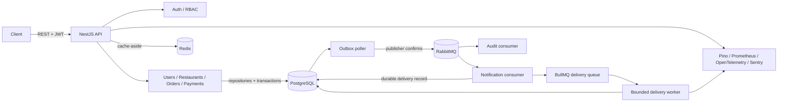

# ScaleForge

[](https://github.com/sujithgnth/scaleforge/actions/workflows/ci.yml)
[](LICENSE)

[Portfolio & résumé](https://sujithgnth.github.io/sujeithgopinath/#resume)

ScaleForge is a production-style NestJS modular monolith for experimenting with backend performance, failure, and resilience. It is deliberately more than CRUD: transactional business flows, durable event publication, idempotent consumers, cache invalidation, telemetry, container deployment, and operational failure paths are first-class parts of the codebase.

The repository is a foundation, not a claim that a local stack behaves like a global production system. Capacity and resilience claims must come from repeatable tests and observed metrics.

## Scaling learning lab

The [ScaleForge scaling lab](docs/scaling-lab.md) turns a 100-to-100M-users system-design ladder into staged, evidence-based exercises against this repository. It maps the implemented cache, outbox, queues, idempotency, health checks, and observability to the relevant scaling concepts while keeping sharding, multi-region, and other unproven designs clearly labeled as exercises.

Run the bounded load probe against a local public endpoint:

```bash
npm run lab:scale -- \
  --url http://localhost:3000/v1/health/live \
  --rate 5 \
  --duration 10
```

The probe reports achieved throughput, status/error counts, client-side backpressure, and successful-request p50/p95/p99 latency. It does not claim production capacity from a laptop run.

## Architecture



The API and worker are separate runtime entry points built from one codebase. This allows independent scaling without creating networked domain microservices. RabbitMQ owns domain-event fan-out; BullMQ owns bounded notification delivery jobs. PostgreSQL is authoritative, while Redis remains disposable operational state.

See [architecture.md](docs/architecture.md) and the [ADRs](adr/) for boundaries, alternatives, failure modes, index rationale, and trade-offs.

## What is implemented

- Registration, login, JWT access tokens, hashed refresh-token storage, rotation, logout, and `ADMIN` / `MANAGER` / `USER` RBAC.
- Server-priced order creation, state-machine transitions, optimistic locking, role-aware listing, pagination, and filtering.
- Idempotent payment-completion simulation. No card data is accepted or stored.
- Prisma 7, PostgreSQL relations, constraints, indexes, migrations, and transactional outbox writes.
- Redis cache-aside restaurant listing with 60-second TTL and prefix invalidation after writes.
- RabbitMQ topic exchange, publisher confirms, durable retry queues, exponential per-message delay, dead-letter queues, prefetch, and idempotent consumers.
- BullMQ notification delivery jobs with deterministic job IDs, bounded concurrency, backoff, database status, and pending-work recovery.
- Correlation IDs, JSON logs with sensitive-field redaction, Prometheus metrics, Grafana provisioning, Loki ingestion through Grafana Alloy, OpenTelemetry traces through the Collector and Tempo, and optional Sentry capture.
- Helmet, strict DTO validation, generic authentication failures, global throttling, tighter auth throttles, consistent errors, non-root containers, and Kubernetes security contexts.
- Jest service tests, Supertest HTTP/OpenAPI contract tests, and a Testcontainers integration flow using PostgreSQL, Redis, and RabbitMQ.
- Docker Compose, raw Kubernetes manifests, Kustomize, and a Helm chart.

## Prerequisites

- Node.js 22 or newer
- npm 11 or newer
- Docker with Compose for the full stack and integration tests
- Optional: `kubectl` and Helm 3 for manifest validation

## Local setup

### Full stack

```bash
docker compose up --build -d
docker compose ps
curl http://localhost:3000/v1/health/ready
```

Local endpoints:

| Surface     | URL                          | Local credentials            |
| ----------- | ---------------------------- | ---------------------------- |
| Swagger UI  | <http://localhost:3000/docs> | none                         |
| API         | <http://localhost:3000/v1>   | register or seed a user      |
| Prometheus  | <http://localhost:9090>      | none                         |
| Grafana     | <http://localhost:3001>      | `admin` / `local-only-admin` |
| RabbitMQ UI | <http://localhost:15672>     | `scaleforge` / `scaleforge`  |

The Compose credentials are development-only. Replace them before any shared deployment.

Stop the stack without deleting its named volumes:

```bash
docker compose down
```

### Run the API and worker on the host

Start PostgreSQL, Redis, and RabbitMQ, then:

```bash
cp .env.example .env
npm install
npm run prisma:generate
npm run prisma:migrate:deploy
npm run start:dev
```

In another terminal:

```bash
npm run start:worker:dev
```

To seed an administrator, explicitly set `SEED_ADMIN_EMAIL` and `SEED_ADMIN_PASSWORD`, then run `npm run prisma:seed`. The seed deliberately does not ship with a default password.

## API

All business routes use URI versioning under `/v1`. Important routes are:

| Method  | Path                      | Access                    | Purpose                           |
| ------- | ------------------------- | ------------------------- | --------------------------------- |
| `POST`  | `/v1/auth/register`       | Public, throttled         | Create user and token pair        |
| `POST`  | `/v1/auth/login`          | Public, throttled         | Authenticate                      |
| `POST`  | `/v1/auth/refresh`        | Public, throttled         | Rotate refresh token              |
| `POST`  | `/v1/auth/logout`         | Public                    | Revoke refresh token              |
| `GET`   | `/v1/restaurants`         | Authenticated             | Cached active menu                |
| `POST`  | `/v1/restaurants`         | Admin, manager            | Create restaurant and menu        |
| `POST`  | `/v1/orders`              | Authenticated             | Create server-priced order        |
| `GET`   | `/v1/orders`              | Authenticated             | Paginated, filtered list          |
| `PATCH` | `/v1/orders/:id/status`   | Role/state dependent      | Optimistic state transition       |
| `POST`  | `/v1/orders/:id/payments` | Owner or elevated role    | Idempotent completion record      |
| `GET`   | `/v1/audit`               | Admin, manager            | Recent audit records              |
| `GET`   | `/v1/health/live`         | Public                    | Process liveness                  |
| `GET`   | `/v1/health/ready`        | Public                    | PostgreSQL/Redis/Rabbit readiness |
| `GET`   | `/v1/metrics`             | Public in this foundation | Prometheus exposition             |

Swagger UI is at `/docs`. Generate and validate a machine-readable snapshot with:

```bash
npm run openapi:generate
```

The generated `openapi.json` is intentionally ignored because CI can reproduce it. In a public deployment, protect `/metrics` and consider restricting Swagger to internal networks.

## Verification

```bash
npm run verify
npm run test:integration
docker compose config --quiet
kubectl kustomize k8s >/dev/null
helm lint helm/scaleforge
```

`npm run test:integration` starts isolated PostgreSQL, Redis, and RabbitMQ containers, deploys migrations, boots both entry points, and verifies authentication, cache hit/miss behavior, server-side pricing, idempotent payment, outbox delivery, Rabbit consumers, BullMQ delivery, readiness, and metrics.

## Deployment

- Raw manifests: `kubectl apply -k k8s` after creating a real `scaleforge-secrets` Secret and replacing the image reference.
- Helm: `helm upgrade --install scaleforge helm/scaleforge -f secure-values.yaml`.
- Build and publish both the `runtime` and `migration` Docker targets. Run the migration Job before rolling out a schema-dependent runtime image. The Helm chart uses a pre-install/pre-upgrade hook and a separately configured migration image.
- PostgreSQL, Redis, RabbitMQ, the OpenTelemetry Collector, and ingress are expected to be managed dependencies in a real cluster; the chart deploys only ScaleForge workloads.

## Design decisions and boundaries

- The transactional outbox closes the database/RabbitMQ dual-write gap, but delivery is still at least once. Consumers use `(consumer, eventId)` uniqueness to make replay safe.
- Refresh tokens are JWTs for expiry and identity but are also Argon2id-hashed in PostgreSQL so logout and rotation can revoke them. Access tokens remain stateless and short-lived.
- The payment endpoint models provider confirmation and idempotency; it is not a payment gateway and must sit behind a PCI-compliant provider integration before real use.
- HPA CPU is a safe baseline, not proof of optimal scaling. Queue depth, oldest-message age, database pool saturation, and latency should become external metrics after real load evidence exists.
- The local Alloy configuration reads the Docker socket to discover logs. This is convenient for development but too privileged for many production environments; use the cluster's managed log agent there.

## Developer AI support

Repository rules live in [AGENTS.md](AGENTS.md). Focused agent briefs are under `.agents/`, and validated project skills are under `skills/` for backend, security, performance, and architecture reviews.
