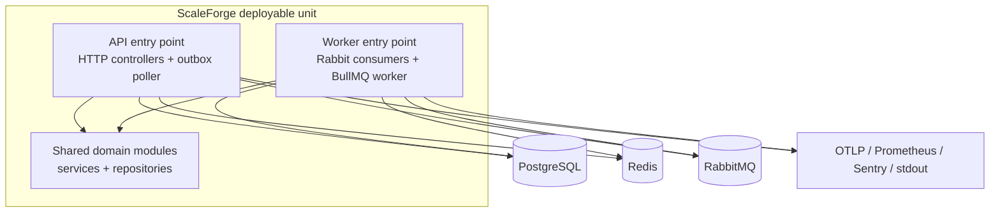
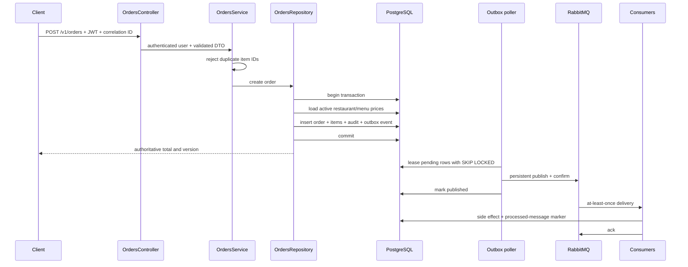

# ScaleForge architecture

## Goals and constraints

ScaleForge needs credible production mechanics while remaining runnable on one developer machine. The design optimizes for maintainability, explicit failure handling, testability, and later performance visualization. It does not optimize for independent team deployment, global multi-region writes, or premature service decomposition.

Quality attributes, in priority order:

1. Correctness and security of state changes.
2. Recoverability under database, Redis, RabbitMQ, and worker failures.
3. Observable latency, errors, event delivery, and dependency health.
4. Horizontal scaling without shared in-process state.
5. Clear module ownership and low-cost future extraction.

## Runtime view

The entry points can scale independently, but they share one repository and one relational model. That is a modular monolith with process specialization, not domain microservices.

## Module boundaries

| Module          | Owns                                                                    | May depend on                     |
| --------------- | ----------------------------------------------------------------------- | --------------------------------- |
| `auth`          | Credentials, token issuance/rotation, login policy                      | `users`, JWT/config               |
| `users`         | User identity, role administration, refresh-token persistence           | `database`                        |
| `restaurants`   | Restaurants, menu items, active-menu cache policy                       | `database`, Redis adapter         |
| `orders`        | Order creation, totals, state transitions, list scope                   | `database`, request context       |
| `payments`      | Idempotent provider-completion records                                  | `orders`, `database`              |
| `audit`         | Queryable audit history and audit event consumer                        | `database`                        |
| `notifications` | Delivery records and BullMQ processing                                  | `database`, Redis/BullMQ          |
| `queue`         | Domain-event envelopes, Rabbit topology, outbox publication/consumption | domain handlers, database         |
| `observability` | Metrics registry and HTTP metrics                                       | none of the domains               |
| `common`        | Guards, decorators, request context, cache adapter, errors              | configuration/infrastructure only |

HTTP code follows `Controller -> Service -> Repository -> Prisma`. Controllers bind transport data. Services own authorization-adjacent business policy and transitions. Repositories own query shape and transactional persistence. Infrastructure adapters own Redis, RabbitMQ, BullMQ, and telemetry details.

## Order consistency path

The client never supplies a total. Menu prices are copied to `OrderItem` inside the same transaction, preserving purchase history if the menu later changes. The outbox event is committed with the order, preventing a committed order with no durable publication record.

There is still a crash window after RabbitMQ confirms and before `publishedAt` is written. Republish is therefore possible. Consumers must remain idempotent; exactly-once delivery is not claimed.

## Messaging responsibilities

RabbitMQ and BullMQ are intentionally not interchangeable:

- RabbitMQ distributes domain facts such as `OrderCreated` and `PaymentCompleted` to multiple bounded contexts. Each consumer has its own durable queue, retry queue, and DLQ.
- BullMQ executes notification-delivery work after the notification consumer has persisted a delivery record. A deterministic delivery ID prevents duplicate jobs while the database status makes recovery explicit.

Rabbit retry behavior:

1. Consume with manual acknowledgement and prefetch `10`.
2. On failure, publish to `scaleforge.retry` with incremented `x-retry-count` and exponential per-message expiration.
3. The retry queue dead-letters expired messages back to the domain exchange with the original routing key.
4. After three retries, publish to `scaleforge.dlx` and acknowledge the original only after publisher confirmation.
5. Use the `processed_messages` unique constraint to make redelivery safe.

Production runbooks should alert on DLQ depth, oldest outbox age, retry rate, and notification records stuck in `PROCESSING`.

## Data model and indexes

PostgreSQL stores business truth. UUID primary keys avoid coordination during horizontal writes. Money uses `DECIMAL(12,2)` and is returned as a string by Prisma, avoiding binary floating-point persistence.

| Index                                   | Query supported                           | Reason                                             |
| --------------------------------------- | ----------------------------------------- | -------------------------------------------------- |
| `users_email_key`                       | Login/registration lookup                 | Uniqueness and constant-time identity lookup       |
| `refresh_tokens_user_expiry_idx`        | Token cleanup and user-session inspection | Groups revocable tokens and expiry ordering        |
| `restaurants_active_name_idx`           | Active catalog ordered by name            | Matches the cached catalog miss query              |
| `menu_items_restaurant_available_idx`   | Validate an active restaurant menu        | Narrows authoritative item lookup                  |
| `orders_user_created_idx`               | User order timeline                       | Primary `USER` list path with newest first         |
| `orders_restaurant_status_created_idx`  | Restaurant operations filtering           | Supports manager filters without global scans      |
| `orders_status_created_idx`             | Cross-restaurant operational status view  | Supports admin/manager status filtering            |
| `payments_idempotency_key_key`          | Safe client payment retries               | Database-enforced idempotency                      |
| `audit_aggregate_created_idx`           | Entity history                            | Orders audit records chronologically per aggregate |
| `outbox_pending_idx`                    | Poll unpublished, due events              | Keeps the lease query on a narrow ordered set      |
| `outbox_lock_idx`                       | Reclaim expired leases                    | Supports crash recovery                            |
| `processed_messages_consumer_event_key` | Consumer deduplication                    | Enforces idempotency under concurrent redelivery   |
| `notification_status_created_idx`       | Pending delivery recovery                 | Supports bounded oldest-first recovery scans       |

Indexes add write amplification and storage cost. They are based on implemented query shapes, not speculative fields. Validate them with `EXPLAIN (ANALYZE, BUFFERS)` and representative data before adding more. The broad order list uses offset pagination for a clear public contract; switch high-volume timelines to cursor pagination only after preserving stable sorting and API compatibility.

## Cache model

The active restaurant catalog uses cache-aside:

- Key: `restaurants:active:v1`
- TTL: 60 seconds
- Miss: read PostgreSQL, serialize, populate Redis
- Write: commit PostgreSQL, invalidate `restaurants:active:*`
- Redis failure: the current request fails rather than silently hiding an unhealthy dependency

The last behavior is deliberately strict for the foundation and makes failure visible. A production product may choose database fallback for catalog reads if availability is more important than surfacing cache failure. That change requires metrics and an ADR because it changes readiness and overload behavior.

## Security model

- Argon2id hashes passwords and stored refresh tokens.
- Access tokens are short-lived. Refresh JWTs rotate and their `jti` records are revoked transactionally.
- Global authentication is opt-out through `@Public`; global RBAC is additive through `@Roles`.
- Order list scope and payment ownership are enforced in services, not trusted from JWT role alone.
- DTO whitelist and `forbidNonWhitelisted` reject unknown fields.
- Helmet sets HTTP security headers. Rate limits apply globally with tighter auth limits.
- Pino redacts authorization, password, refresh-token, and cookie paths.
- Prisma tagged templates parameterize the outbox lease query.
- Containers run as the Node user; Kubernetes drops capabilities, forbids privilege escalation, disables service-account token mounting, and uses a read-only root filesystem.

Remaining deployment work includes managed secrets, ingress authentication for metrics/docs, CORS policy, WAF/edge limits, network policies, database TLS verification, dependency patch operations, backup/restore tests, and provider-specific Sentry data-scrubbing review.

## Observability

- `x-correlation-id` is accepted up to 100 characters or generated as a UUID and returned on the response.
- Pino writes structured stdout logs; Grafana Alloy discovers Compose containers and forwards logs to Loki.
- Prometheus exposes Node process metrics, request count/latency, outbox publishes, and messaging failures.
- OpenTelemetry auto-instrumentation exports OTLP/HTTP traces when an endpoint is configured. The local Collector batches and forwards to Tempo.
- Sentry is optional and receives unhandled exceptions when `SENTRY_DSN` is configured.
- Readiness checks PostgreSQL, Redis, and RabbitMQ. Liveness checks only the process.

Avoid high-cardinality metric labels: route templates, status, event type, and consumer are bounded; IDs and correlation IDs remain in logs/traces.

## Scaling model

- API pods are stateless and can scale horizontally. Outbox leases use `FOR UPDATE SKIP LOCKED` semantics in one atomic update so multiple pollers do not own the same row concurrently.
- Worker replicas compete safely on RabbitMQ and BullMQ queues. Idempotency protects redelivery, not arbitrary non-idempotent provider side effects; a provider adapter must pass an idempotency key.
- HPA starts with CPU because Metrics Server is widely available. It should evolve to latency or concurrency for the API and queue age/depth for workers after those signals are proven.
- PostgreSQL connection count becomes a hard limit before CPU-only HPA can scale indefinitely. Set replica limits from the database connection budget and add PgBouncer when evidence requires it.
- Redis is a single local instance in Compose. Production needs a managed topology appropriate to cache and BullMQ durability requirements.

## Failure scenarios

| Failure                                | Expected behavior                                           | Recovery / signal                                                                              |
| -------------------------------------- | ----------------------------------------------------------- | ---------------------------------------------------------------------------------------------- |
| PostgreSQL unavailable                 | Writes fail; readiness becomes unhealthy                    | Restore DB; clients retry only idempotent operations; alert on readiness/error rate            |
| Redis unavailable                      | Catalog/BullMQ operations fail; readiness becomes unhealthy | Restore Redis; cache repopulates; pending notification records are recovered                   |
| RabbitMQ unavailable during request    | Business transaction and outbox row still commit            | Outbox retry with capped exponential delay; alert on oldest pending age                        |
| API crashes after event confirm        | Event may be published twice                                | Idempotent consumer marker absorbs duplicate                                                   |
| Consumer handler fails transiently     | Message moves through durable retry queue                   | Up to three retries; metric increments                                                         |
| Consumer fails permanently             | Message lands in consumer DLQ                               | Operator diagnoses, fixes, and explicitly replays                                              |
| Worker crashes after claiming delivery | Record may remain `PROCESSING`                              | Current foundation needs an operator reset/runbook; add processing lease before real providers |
| Concurrent order status updates        | One update wins by `version`; loser gets `409`              | Client reloads and applies a valid transition                                                  |
| Repeated payment request               | Same idempotency key returns one record                     | Unique constraint prevents duplicate payment row/event                                         |
| OTLP/Sentry unavailable                | Application continues; exporter may buffer/drop             | Alert in telemetry pipeline; business requests remain independent                              |

The stuck `PROCESSING` notification case is an intentional documented limitation. Before connecting a real external notification provider, add a lease timestamp and recovery of expired claims.

## Deployment topology

Compose runs the complete learning environment: API, worker, PostgreSQL, Redis, RabbitMQ, Prometheus, Grafana, Loki, Alloy, OpenTelemetry Collector, and Tempo. Kubernetes manifests and Helm deploy only the application workloads and assume managed dependencies. Schema migrations run as a separate Job rather than in every API replica.

See ADRs:

- [001: PostgreSQL and Prisma](../adr/001-database-choice.md)
- [002: cache-aside Redis](../adr/002-cache-strategy.md)
- [003: RabbitMQ events plus BullMQ jobs](../adr/003-queue-strategy.md)
- [004: layered observability](../adr/004-observability.md)
